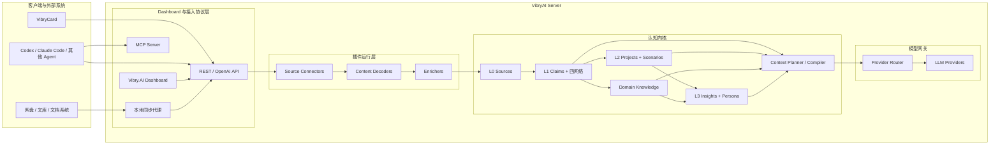

# VibryAI Server 认知内核与插件体系重构计划

> 状态：已实现基线，待真实数据验证
> 目标版本：VibryAI Server Cognitive Core v2
> 核心定位：面向个人的 Agent 无关认知后端、第二大脑与 AI 网关
> 文档性质：实现记录与后续路线图。第 10 节只概述接口分组，完整现行契约见 `API_REFERENCE.md`；后文标为规划的内容不得视为已上线功能。

## 当前实现状态

本文件保留目标架构与后续演进方向。以下能力已经在当前 VibryAI
Server 中落地并由自动化测试覆盖：

| 能力 | 当前实现 |
|---|---|
| L0 Source | 录音转写、手工录入、文档、聊天和 Agent 历史统一写入可追溯 Source 与持久任务队列。 |
| L1 Claims | 提取四网络主张、实体、时间、置信度与证据片段；精确重复合并，语义相似仅产生待确认关系。 |
| L2 Projects | 自动多项目归类、置信度、人工多选标签与拒绝记录；人工拒绝不会被后续自动归类覆盖。 |
| L3 Insights | 脏项目由夜间调度器增量处理，也可在 Dashboard 手动触发；每条洞察绑定 Claim 证据。 |
| 专业资料 | 文档文本和网页内容作为 Source/Claim 进入统一证据链；独立 Knowledge/Wiki 表和审核接口已删除。 |
| 检索 | 词法和持久向量混合检索；使用本地 FastEmbed 或远程 Embedding，失败时任务明确报错并可重试，不静默降级。 |
| Dashboard 与扩展 | 第二大脑、项目纠偏、素材管理、洞察证据、任务重试、插件状态和 MCP 配置均已进入后台。 |
| 遗留系统 | Mem0、Qdrant 与旧 Wiki RAG 不再是运行依赖；历史数据仅能经一次性导入进入新模型。 |

尚未以真实工作数据完成的事项是洞察质量、成本和架构复杂度 ROI
评估。该项需要有代表性的会议转写、项目材料和人工标注后执行，不能用
空样本或合成数据宣称完成。

---

## 1. 重构目标

`Vibry.AI` 是产品的个人认知内核与整体品牌。`VibryAI Server` 是 Vibry.AI 的完整实现主体，同时提供认知服务、AI 网关和主要 Dashboard。

VibryAI Server 不再由“模型代理、Mem0、Wiki、录音、洞察”等相互独立的功能拼装而成，而是成为一个统一的个人认知系统。

它负责把录音、文档、聊天、Agent 历史等来源转化为：

1. 可追溯的原始证据；
2. 有实体、时间、置信度和来源的原子主张；
3. 围绕项目持续演化的上下文；
4. 个人专业领域的高价值知识；
5. 有证据支持的项目洞察和个人洞察；
6. 可供任意 Agent 调用的高质量上下文。

最终产品闭环为：

```text
采集现实与数字活动
  -> 保存原始证据
  -> 提取记忆与知识
  -> 自动关联项目
  -> 持续形成项目状态
  -> 定期生成深度洞察
  -> 为每次模型调用编译最合适的上下文
  -> 接收用户反馈并修正认知状态
```

### 1.1 三层产品结构

| 产品 | 定位 | 应承担的职责 | 不应承担的职责 |
|---|---|---|---|
| VibryCard | 现实世界采集器 | 录音、同步、播放、转写展示、项目提示、轻量纠错 | 独立长期记忆、独立项目洞察 |
| VibryAI Server | Vibry.AI 实现主体与 Dashboard | Source、Memory、Knowledge、Project、Insight、Context、Gateway、配置和第二大脑工作台 | 依赖某个专用桌面端才能工作 |
| 外部 Agent 与插件 | 扩展客户端、采集器和执行工具 | 通过 OpenAI API、MCP、REST 或同步插件使用和补充 Vibry 上下文 | 直接修改核心认知数据库 |

VibryNote 不在当前产品规划内。未来可以使用 Flutter 开发独立的跨平台 `VibryAI App`，覆盖桌面端和移动端；它作为 VibryAI Server 的官方个人客户端，通过标准接口访问认知能力，不拥有独立认知逻辑，也不构成本次重构的依赖。

### 1.2 Dashboard 定位

现有 VibryServer 管理后台沿用并升级为 VibryAI Server Dashboard。它既是服务器配置后台，也是个人第二大脑的主要工作台，包含：

- 今日与每周洞察；
- 项目列表、项目状态、时间线和风险；
- Source Inbox、自动归类建议和轻量纠错；
- 记忆、知识和证据审阅；
- 全局搜索与“为什么这样回答”的上下文追踪；
- 插件、同步任务、处理队列和错误管理；
- 模型、Provider、Token、ASR、成本和系统配置。

Dashboard 调用与外部 Agent 相同的公开应用服务，不直接绕过 API 操作数据库。

### 1.3 未来 VibryAI App

未来的 VibryAI App 是可选的跨平台体验层，而不是第四套后端或新的事实源。建议使用 Flutter 实现 Windows、macOS、Linux、Android 和 iOS 的共享客户端能力。

它可以提供：

- 桌面常驻、全局快捷输入和系统分享入口；
- 与 VibryAI Server Dashboard 一致的项目、洞察和全局搜索；
- 本地文件夹、Codex、Claude Code 和其他 Agent Connector 管理；
- 本地离线缓存、同步状态和敏感内容上传确认；
- 语音、截图、剪贴板和文件快速采集；
- 面向个人工作流的原生通知与夜间洞察提醒。

边界要求：

- 所有长期认知状态仍以 VibryAI Server 为准；
- App 仅保存离线缓存、待上传队列、Connector 游标和本机配置；
- Dashboard、App、VibryCard 和外部 Agent 共用同一套 API、权限和数据模型；
- App 的缺席不能影响服务器认知、定时洞察和 Agent 调用。

### 1.4 本次重构的核心原则

- **统一证据，分层认知**：所有内容先进入统一 Source 层，Memory、Knowledge、Project、Insight 都是基于证据生成的认知投影。
- **项目是一等对象**：项目不是一个字符串分类，而是拥有目标、阶段、指标和状态的长期工作空间。
- **Memory 与 Knowledge 分开治理、统一检索**：二者不再是两个产品入口，也不再维护两套互不相干的来源和索引。
- **插件位于系统边界**：语音、Codex、Claude Code、网盘等作为采集或处理插件；核心认知规则不能散落在插件中。
- **Agent 无关**：任何 Agent 都可通过标准协议使用 VibryAI Server。
- **默认自动、允许纠错**：用户无需在上传前完成复杂分类，只在低置信度或重要决策处做轻量确认。
- **所有推断可回溯**：摘要、洞察、Persona 和项目状态必须能够回到 Source 或 Claim。
- **派生数据可重建**：向量、聚类、场景摘要和洞察均可由基础证据重新生成。
- **先模块化单体，后考虑微服务**：当前规模不需要分布式系统，先用清晰模块边界降低复杂度。

---

## 2. 当前架构问题

### 2.1 多个彼此独立的数据中心

当前系统同时存在：

- `data/vibrycard.db`：录音、转写、纪要、洞察、聊天、配置；
- `raw/` 与 `wiki/`：Wiki 原始材料和编译页面；
- VibryCard 本地 `MemoryNode` 与分类洞察缓存；
- 旧 Qdrant/Mem0 数据。

相同内容可能以转写、纪要、MemoryNode、Atom、Wiki raw 等形式重复存在，但缺少统一 `source_id`，无法稳定追踪“某个结论来自哪里”。

### 2.2 单条录音洞察不是项目洞察

当前 `/api/insight` 只分析一次转写。它可以产生机会、风险和建议，但不知道：

- 该内容属于哪个项目；
- 项目此前做过什么决策；
- 新内容相对上一次发生了什么变化；
- 哪些问题反复出现；
- 某个商业假设是否得到持续支持或反驳。

因此当前洞察应视为“Source 级即时分析”，不能继续承担 L2/L3 洞察职责。

### 2.3 Memory 与 Wiki 只是并列检索

当前聊天流程分别搜索 Memory 和 Wiki，再拼入 prompt。系统没有统一判断：

- 当前查询是否需要个人记忆；
- 是否需要项目状态；
- 是否涉及小众专业知识；
- 哪些内容重复或矛盾；
- 在有限 token 中应该优先保留什么。

重构后应由统一 Context Planner 和 Context Compiler 决定检索与注入。

### 2.4 分类模型不能表达项目关系

现有 `category` 和“第一个 tag 是主分类”的方式不能表达：

- 一份内容属于多个项目；
- AI 建议、用户确认、用户拒绝之间的区别；
- 项目与主题/场景的区别；
- 归类置信度和历史纠错；
- 项目阶段变化。

### 2.5 客户端承担了过多业务逻辑

VibryCard 当前编排转写、摘要、洞察、本地记忆和分类聚合。这样会导致：

- App 退出后任务中断；
- 多客户端状态不一致；
- 服务端无法统一夜间处理；
- 后续 Agent 导入需要重复实现同一套逻辑。

VibryCard 应只提交 Source、显示服务端 Job 状态并提供纠错入口。

---

## 3. 目标总体架构



### 3.1 分层定义

| 层级 | 名称 | 内容 | 更新方式 |
|---|---|---|---|
| L0 | Source Evidence | 音频、转写、文档、聊天、Agent 事件、网页快照 | 每次采集，原始证据不可静默覆盖 |
| L1 | Claims | 原子主张、四网络、实体、时间、置信度、证据片段 | 输入后增量提取与巩固 |
| L2 | Projects | 项目、项目成员关系、场景、状态、决策、行动项、指标 | Source 写入后轻量更新，定期重新聚合 |
| L3 | Insights | 项目深度洞察、跨项目模式、Persona、能力与决策习惯 | 夜间增量执行，必要时人工确认 |

Knowledge 不单独占一个 L 层。它主要由 L1 `world` Claims 经过筛选和编译形成，是面向专业复用的认知投影。

---

## 4. 认知内核模块

建议将 VibryAI Server 核心代码组织为：

```text
VibryServer/
  dashboard/          # Vibry.AI 第二大脑工作台与服务器管理界面
  cognition/
    sources/          # Source、版本、内容与证据片段
    extraction/       # 文本规范化、Claim 提取、实体解析
    claims/           # 四网络、巩固、冲突和关系图
    projects/         # 项目、归属、Scenario、项目状态
    knowledge/        # 专业知识主题、Knowledge Page、版本
    insights/         # Source/Project/Global 洞察
    retrieval/        # 多路召回、RRF、图扩展、重排
    context/          # 查询规划、token 预算、上下文编译
    feedback/         # 用户确认、拒绝、纠正、合并、拆分
    jobs/             # 异步任务、夜间任务、水位线和重试
  plugins/
    runtime/          # 插件注册、权限、配置与生命周期
    builtin/
      audio/          # 音频、ASR、声纹、会议结构化
      documents/      # PDF/DOCX/Markdown/纯文本解析
      agent_import/   # Agent 历史导入协议与标准化
  protocols/
    openai/           # OpenAI 兼容 API
    mcp/              # Vibry MCP Server
    rest/             # Source、Project、Insight API
  providers/          # LLM、Embedding、ASR Provider 适配器
```

### 4.1 核心模块与插件的边界

插件可以：

- 发现和读取外部来源；
- 把私有格式转换为统一 Source；
- 执行格式专属处理，如 ASR、声纹、OCR、代码仓库元数据提取；
- 声明自身权限、配置和处理能力。

插件不能：

- 直接写入 Persona；
- 绕过 Source 直接创建“可信记忆”；
- 自行维护另一套项目、向量库或洞察数据库；
- 把 Agent 生成内容伪装成用户原始证据；
- 静默删除或覆盖核心证据。

认知内核统一负责 Claim 提取、项目归类、Knowledge 编译、Insight 和 Context。

---

## 5. 核心数据模型

### 5.1 Source：统一原始来源

```text
sources
  id
  user_id
  source_type          recording | document | chat | agent | web | manual
  origin               vibry_card | codex | claude_code | drive | api | ...
  external_id
  title
  mime_type
  content_uri
  content_hash
  occurred_at
  captured_at
  parent_source_id
  derivation_type      original | transcript | normalized | generated
  metadata_json
  status
  created_at / updated_at
```

规则：

- 音频是一个 Source，转写是它的派生 Source；
- 文档原文件与解析文本分别保存并建立父子关系；
- Agent 中的用户消息、助手消息、工具结果必须区分作者和证据类型；
- 使用 `origin + external_id` 和 `content_hash` 保证幂等导入；
- 原始内容不因重新提取而改变，提取结果通过版本更新。

### 5.2 Claim：L1 原子主张

```text
claims
  id
  user_id
  network              world | experience | observation | opinion
  content
  subject_entity_id
  predicate
  object_json
  occurred_at
  valid_from / valid_to
  confidence
  status               active | superseded | disputed | retracted
  extraction_version
  created_at / updated_at

claim_evidence
  claim_id
  source_id
  span_start / span_end
  quote
  support_type         supports | contradicts | derived_from

claim_relations
  from_claim_id
  to_claim_id
  relation_type        duplicate | refines | supersedes | contradicts | causes | follows
  confidence
```

向量相似度只用于寻找候选，不直接决定覆盖或删除。新 Claim 必须经过支持、细化、替代、矛盾或新增判断。

### 5.3 Entity：统一实体层

```text
entities
  id
  user_id
  entity_type          person | company | project | product | place | concept
  canonical_name
  aliases_json
  metadata_json

claim_entities
  claim_id
  entity_id
  role
```

项目、人物和专业概念都使用统一实体解析，但项目仍拥有独立业务表。

### 5.4 Project：L2 项目空间

```text
projects
  id
  user_id
  name
  description
  goal
  stage
  status
  constraints_json
  metrics_json
  tags_json
  created_at / updated_at

project_memberships
  project_id
  object_type          source | claim | scenario | knowledge
  object_id
  assignment_source    user | auto | rule | plugin
  confidence
  status               suggested | confirmed | rejected
  reason_json

scenarios
  id
  project_id
  title
  summary
  state_json
  start_at / end_at
  status
```

一份 Source、一个 Claim 或一个 Knowledge Asset 可以属于多个项目。用户确认是强信号，普通标签是软信号，用户拒绝是负信号。

### 5.5 Knowledge：专业知识投影

```text
knowledge_assets
  id
  user_id
  title
  domain
  content
  status               candidate | compiled | reviewed | archived
  version
  freshness_at
  created_at / updated_at

knowledge_evidence
  knowledge_id
  source_id / claim_id
  relation_type
```

Knowledge 只保存用户小众专业、内部资料、权威标准或项目需要反复使用的内容。大模型普遍知道且不要求最新证据的通用知识默认不写入。

Markdown Wiki 可保留为 Knowledge 的导出和人工审阅视图，不再作为唯一数据库或独立检索链。

### 5.6 Insight：L3 洞察

```text
insight_runs
  id
  user_id
  scope_type           source | project | global
  scope_id
  trigger_type         ingest | nightly | manual
  watermark
  model / prompt_version
  status
  token_usage / cost
  created_at / finished_at

insights
  id
  run_id
  project_id
  insight_type         fact | inference | risk | opportunity | gap | recommendation
  title
  content
  confidence
  novelty_score
  status               active | confirmed | rejected | superseded
  valid_from / valid_to

insight_evidence
  insight_id
  source_id / claim_id / knowledge_id
  role                  support | contradict | benchmark
```

洞察必须区分事实、推断和建议。派生洞察不能再次作为独立事实提高自身置信度。

---

## 6. 统一采集与处理流水线

### 6.1 标准流程

```text
1. Capture
   接收文件、文本、录音、Agent 事件

2. Persist L0
   计算 hash，保存 Source，返回 source_id

3. Decode
   ASR / OCR / 文档解析 / Agent 格式标准化

4. Analyze Source
   即时摘要、决策、行动项、风险、实体、时间

5. Extract Claims
   生成四网络 Claim 和证据片段

6. Consolidate
   与既有 Claim 判断重复、细化、替代、矛盾

7. Route
   推荐 Memory、Project、Knowledge 或临时缓冲区

8. Classify Projects
   支持多项目归属和低置信度待确认

9. Update L2
   标记项目为 dirty，增量更新项目状态

10. Reflect L3
    夜间处理 dirty 项目并生成深度洞察
```

### 6.2 Source 路由结果

```json
{
  "source_id": "src_123",
  "routes": [
    {"target": "memory", "network": "experience", "confidence": 0.96},
    {"target": "project", "project_id": "project_vibry", "confidence": 0.88},
    {"target": "project", "project_id": "project_customer", "confidence": 0.72},
    {"target": "knowledge_candidate", "domain": "AI memory", "confidence": 0.67}
  ],
  "needs_confirmation": false
}
```

路由不是互斥分类。一份内容可同时进入多个项目，并产生个人记忆和专业知识候选。

### 6.3 自动项目归类

初始可解释评分：

```text
project_score =
    0.40 * semantic_similarity
  + 0.25 * shared_entities
  + 0.20 * user_tag_match
  + 0.10 * recent_project_activity
  + 0.05 * source_origin_rule
```

建议规则：

- 高分且领先第二名明显：自动归入；
- 多个项目均高分：同时归入多个项目；
- 中等置信度：状态为 `suggested`，不阻塞处理；
- 低置信度：进入待归类 Inbox；
- 用户确认或拒绝后保存为后续路由信号。

---

## 7. 插件体系规划

### 7.1 插件不是所有功能的统称

建议只把外部系统差异和格式差异做成插件。Memory、Project、Insight、Context 属于核心能力，不应以可选插件形式相互拼装。

插件分为四类：

| 类型 | 职责 | 示例 |
|---|---|---|
| Source Connector | 发现、拉取或接收来源 | Codex 历史、Claude Code 历史、网盘、邮箱 |
| Content Decoder | 把私有格式转换为标准内容 | ASR、PDF/DOCX、OCR、Agent JSONL |
| Enricher | 添加来源专属元数据 | 声纹、说话人、代码仓库、Git commit |
| Protocol Adapter | 向外部客户端提供能力 | OpenAI API、MCP Server、Webhook |

### 7.2 插件 Manifest

```json
{
  "id": "vibry.audio",
  "version": "1.0.0",
  "type": ["source_connector", "content_decoder", "enricher"],
  "entrypoint": "plugins.builtin.audio:AudioPlugin",
  "source_types": ["audio/wav", "audio/ogg", "audio/opus"],
  "permissions": ["source:write", "blob:read", "job:write"],
  "config_schema": "audio.config.schema.json",
  "runs_on": "server"
}
```

运行时需要提供：

- 插件发现与注册；
- 配置校验；
- 能力与权限声明；
- Job 提交和状态回报；
- 超时、重试和取消；
- 插件版本与处理版本记录；
- 健康检查；
- 禁用与降级。

首版只允许内置和受信任插件在进程内运行。未来第三方插件应使用子进程或容器隔离，不能直接访问核心数据库。

### 7.3 VibryCard 语音处理插件

可行，并且非常适合作为第一套内置插件。它应拆为可组合阶段：

```text
AudioCapture Source
  -> AudioNormalize
  -> ASR Provider
  -> Speaker Diarization / Voiceprint
  -> Transcript Source
  -> Meeting Structure Enricher
  -> Core Ingestion Pipeline
```

语音插件负责：

- 音频格式识别与转码；
- 本地/云端 ASR Provider 调用；
- 时间戳和说话人信息；
- 声纹匹配；
- 输出标准 Transcript Source。

它不负责：

- 自己维护记忆；
- 自己决定最终项目状态；
- 独立生成不可追溯的长期洞察；
- 把客户端分类字符串当作唯一项目归属。

重构后 VibryCard 流程为：

```text
上传音频 -> 获得 source_id/job_id -> 查询任务状态
-> 显示转写/摘要/项目建议 -> 用户可调整
```

### 7.4 Codex 与 Claude Code 本地历史导入插件

技术上可行，但需要区分插件运行位置。

Codex、Claude Code 历史通常位于用户本地机器。若 VibryAI Server 部署在远端服务器，它无法直接读取这些目录。因此建议采用：

```text
本地 vibry-sync 或 Agent 专属 Connector
  -> 只读扫描 Agent 历史
  -> 增量解析和隐私过滤
  -> 转换为标准 AgentEvent
  -> 通过 Ingest API 上传 VibryAI Server
```

每个 Agent Connector 负责：

- 适配版本可能变化的本地文件格式；
- 保存增量游标，不重复上传；
- 区分 user、assistant、tool、system；
- 记录 agent_id、workspace、thread_id、模型和工具调用；
- 支持目录白名单、项目映射和敏感内容排除；
- 在上传前展示范围和预计数据量；
- 支持撤销导入和按 origin 删除。

标准 AgentEvent：

```json
{
  "origin": "codex",
  "external_id": "thread_123:turn_8",
  "workspace": "D:/VibryAI",
  "thread_id": "thread_123",
  "role": "user",
  "content": "重构认知内核...",
  "occurred_at": "2026-07-13T10:20:00+08:00",
  "parent_external_id": null,
  "metadata": {
    "model": "...",
    "tool_names": [],
    "project_hints": ["VibryAI"]
  }
}
```

证据权重必须区分：

- 用户输入：可作为个人/项目证据；
- Agent 回复：只是派生候选，不能证明用户观点；
- 工具输出：可作为 world 候选，但保留工具和外部来源；
- 系统提示：仅作会话配置，默认不进入长期记忆；
- 自动生成的摘要或洞察：不得作为独立证据自我增强。

### 7.5 Agent MCP 插件

可行，而且应作为 VibryAI Server 面向 Agent 的首选协议之一。这里需要区分两个方向：

1. **Vibry MCP Server**：向 Codex、Claude Code 等 Agent 暴露 Vibry 能力；
2. **MCP Client Connector**：Vibry 主动调用其他 MCP Server 获取数据，属于后续能力。

首版优先实现 Vibry MCP Server，提供：

```text
vibry.search_context(query, project_ids, token_budget)
vibry.search_memory(query, project_ids)
vibry.search_knowledge(query, domains)
vibry.get_project_brief(project_id)
vibry.list_project_insights(project_id)
vibry.capture_source(content, source_type, project_hints)
vibry.get_evidence(source_id)
vibry.submit_feedback(target_id, action, correction)
```

MCP Resources 可提供：

```text
vibry://projects/{project_id}/brief
vibry://projects/{project_id}/timeline
vibry://insights/daily
vibry://persona/current
```

MCP 写操作必须使用独立权限。默认 Agent Token 建议只授予 `context:read`、`project:read`；`source:write`、`project:manage` 和 `persona:write` 单独授权。

---

## 8. Context Planner 与 AI 网关

### 8.1 查询规划

每次 OpenAI API 或 MCP 上下文请求先判断：

```text
personal：需要个人经历、偏好、人物关系
project：需要项目状态、决策、行动项、风险
domain：需要用户小众专业知识
insight：需要已有深度判断或跨时间趋势
general：模型自身知识足够，不检索
```

查询可以同时属于多个类型。

### 8.2 统一检索

```text
Query
  -> 实体与时间解析
  -> Vector / FTS / Entity / Temporal 并行候选
  -> 真正的 rank-based RRF
  -> 一到两跳关系扩展
  -> 来源去重和矛盾标记
  -> token budget + 多样性选择
```

Memory 描述现实，Knowledge 提供专业参照，Insight 解释差距。发生冲突时必须同时呈现，而不是静默覆盖。

### 8.3 Context Compiler

上下文按请求动态编译：

```text
身份与表达偏好
+ 显式选中的项目
+ 当前项目状态
+ 与问题相关的历史证据
+ 小众专业知识
+ 有效的最新洞察
+ 来源与置信度说明
```

客户端可通过 header 或请求 metadata 显式指定：

```text
X-Vibry-Project: project_vibry
X-Vibry-Context-Mode: auto | personal | project | domain | none
X-Vibry-Context-Budget: 4000
```

默认使用 `auto`，但必须允许 Agent 禁用自动注入，改为主动调用 MCP 工具。

---

## 9. 夜间洞察体系

### 9.1 洞察节奏

| 触发 | 范围 | 输出 |
|---|---|---|
| Source 写入后 | 单个 Source | 摘要、决策、行动项、风险、项目建议 |
| 项目增量更新 | 单个 Project | 状态变化、最新决策、阻塞和待办 |
| 每日夜间 | dirty Projects | 深度风险、机会、商业假设、信息缺口、下一步 |
| 每周 | Global | 跨项目资源冲突、重复模式、个人决策习惯与 Persona 候选 |

### 9.2 夜间任务规则

- 只处理水位线之后有新证据的项目；
- 读取上次项目快照并生成 delta，不重复总结全部历史；
- 将事实、推断、建议分开输出；
- 每条推断至少引用一个 Claim，重要结论建议引用多个独立 Source；
- 支持反对证据和“不确定”；
- 成本、模型和 prompt 版本写入 `insight_runs`；
- 失败可重试，不能产生半写入结果；
- 用户确认或拒绝后更新 Insight 状态，不直接篡改原始证据。

### 9.3 项目深度洞察模板

建议固定输出：

1. 自上次运行以来发生的关键变化；
2. 已确认决策及其依据；
3. 行动项、负责人、期限与阻塞；
4. 目标和实际进展之间的差距；
5. 被支持或反驳的商业假设；
6. 风险、机会和证据强度；
7. 缺失但应当收集的信息；
8. 三个最值得执行的下一步动作；
9. 与专业 Source/Claim 的差距比较；
10. 全部结论的证据链接。

---

## 10. 当前 API 与兼容策略

以下为 Server 1.0 已实现的接口分组。完整参数、响应和认证边界见
[API_REFERENCE.md](API_REFERENCE.md)。

### 10.1 Cognition v2

```text
POST   /api/v2/sources
GET    /api/v2/sources
GET    /api/v2/sources/{id}
PUT    /api/v2/sources/{id}/projects
GET    /api/v2/jobs/{id}
POST   /api/v2/jobs/{id}/retry
GET    /api/v2/dashboard

GET    /api/v2/projects
POST   /api/v2/projects
GET    /api/v2/projects/{id}
PATCH  /api/v2/projects/{id}
DELETE /api/v2/projects/{id}
GET    /api/v2/projects/{id}/workspace
POST   /api/v2/projects/{id}/chat
POST   /api/v2/projects/{id}/tasks
POST   /api/v2/projects/{id}/memberships
GET    /api/v2/projects/{id}/brief

GET    /api/v2/insights
POST   /api/v2/insights/run
POST   /api/v2/feedback
POST   /api/v2/context/build
GET    /api/v2/memory-matrix
POST   /api/v2/memory-matrix/chat
POST   /api/v2/memory-matrix/items
PATCH  /api/v2/memory-matrix/items/{id}
GET    /api/v2/plugins
GET    /api/v2/operations
```

Server 1.0 尚未提供独立 `/api/v2/search`、`/api/v2/knowledge`、插件配置/同步和
membership 删除接口；不得在客户端中按已实现能力调用。

### 10.2 兼容接口与 OpenAI 网关

保留录音主链路接口，并由 Cognition 流水线承接认知写入：

```text
/api/transcribe  -> 创建 Recording、Source 和 Cognition Job
/api/summarize   -> 生成或读取单条录音纪要
/api/insight     -> 返回 Source 级即时分析
/api/recordings  -> 录音、音频、标签、内容和项目归属
/api/voiceprints -> 声纹登记、发现和管理
/v1/*            -> OpenAI 兼容 models、embeddings 和 chat/completions
/admin/api/*     -> 后台配置、Token、计费、日志、迁移和重建索引
```

独立 Wiki/Knowledge 路由已移除。专业资料通过 Source、Claim、项目和证据检索进入
上下文，不再维护第二套知识库运行链路。

---

## 11. 存储与运行架构

### 11.1 推荐存储

首版继续使用 SQLite，采用一个主业务数据库：

```text
data/vibry.db
  sources / claims / entities
  projects / scenarios
  knowledge / insights
  jobs / plugin_state / feedback
  users / tokens / usage
```

文件与大对象：

```text
data/blobs/{user_id}/{source_id}/original
data/blobs/{user_id}/{source_id}/derived/*
exports/knowledge/*.md
```

向量表、FTS、场景摘要和 Markdown 页面均为派生数据。Embedding 模型和维度必须记录在索引配置中，模型切换时创建新索引并执行重建任务。

### 11.2 Job 系统

首版可以采用 SQLite durable jobs + 单独 worker 进程：

```text
API Process   -> 接收请求、创建 Source 和 Job
Worker        -> ASR、解析、Embedding、提取、聚类、Insight
Scheduler     -> 夜间和每周任务
```

不建议继续使用仅存在于 FastAPI 进程内的队列和 Lock。服务重启后 Job 必须可恢复。

---

## 12. 安全、隐私与认知卫生

个人第二大脑包含高度敏感数据，必须从第一版保留以下能力：

- 所有表和文件以 `user_id` 隔离；
- Token 采用 scope 权限；
- Connector 只读取用户明确授权的路径和来源；
- 支持按 Source、origin、Project 和时间范围删除；
- 删除 Source 时清理或标记所有派生 Claim、Insight 和索引；
- API Key 加密保存，日志不得输出完整密钥和原文；
- 支持数据导出与备份；
- Agent 写入与读取使用不同权限；
- 记录每次自动提取、归类和洞察使用的模型与版本；
- 洞察和 Agent 输出不能形成自我证明循环。

---

## 13. 分阶段实施计划

### Phase 0：冻结概念和契约

目标：先确定稳定语言，不修改业务行为。

工作项：

- 确认 Source、Claim、Project、Knowledge、Insight 的定义；
- 确认四网络与 L0-L3 映射；
- 定义 Source、AgentEvent、Plugin Manifest JSON Schema；
- 定义 API v2 和旧 API 兼容策略；
- 确定单用户优先、SQLite 主数据库和插件信任边界。

验收：任何新功能都能明确落入一个核心模块或插件类型，不再新增模糊的“memory/category/wiki”字段。

### Phase 1：统一 Source 与 Durable Job

目标：所有输入只进入一条稳定管道。

工作项：

- 建立 `sources`、派生关系、blob 存储；
- 建立 durable jobs、worker 和 scheduler；
- `/api/transcribe` 改为 Source + Job 模型；
- 文本和文档 Ingest API；
- 幂等键、hash、失败重试、处理版本；
- 保持 VibryCard 旧接口返回兼容。

验收：录音、文本、文档均可获得统一 `source_id`，服务重启后任务可以恢复。

### Phase 2：L1 Claims 与四网络

目标：替代当前松散的 Memory 写入。

工作项：

- 结构化 Claim 提取；
- Entity resolution；
- Claim evidence 和 relations；
- 增量 FTS/Vector 索引；
- 支持重复、细化、替代和矛盾；

验收：任一 Claim 均可回到 Source 原句，更新后索引和证据一致。

### Phase 3：Projects 与自动归类

目标：把“分类”升级为项目工作空间。

工作项：

- Project CRUD；
- 多项目 membership；
- 自动路由、置信度、待确认 Inbox；
- 用户确认、拒绝、移动、合并反馈；
- Scenario 和项目状态快照；
- VibryCard 标签兼容映射。

验收：一份录音可属于多个项目，自动归类错误可一次纠正并保留反馈。

### Phase 4：专业资料并入 Cognition（已调整）

Server 1.0 已取消独立 Wiki/Knowledge 子系统。小众专业资料作为 `Source` 导入，
由 Claim、Evidence、Project 和 Context Compiler 统一处理；旧 Wiki 路由与运行依赖
已经下线。后续只有在真实数据证明“可发布知识页面”有独立价值时，才考虑把它作为
可重建的只读投影，而不是恢复第二套知识库。

验收：任一专业结论都能回到原始 Source 和证据片段，且与个人记忆使用同一召回协议。

### Phase 5：L2/L3 Insight

目标：从单次摘要升级为持续项目认知。

工作项：

- Source 即时分析；
- 项目 dirty 标记与状态 delta；
- 夜间项目洞察；
- 每周跨项目洞察和 Persona 候选；
- Insight evidence、反馈和版本；
- 成本与运行记录。

验收：夜间任务只处理新增证据，洞察区分事实/推断/建议并引用证据。

### Phase 6：Context Compiler 与网关

目标：让任意 Agent 获得“最懂我且最专业”的上下文。

工作项：

- 查询分类和上下文计划；
- Source/Claim/Project/Insight 统一召回；
- RRF、图扩展、token budget 和去重；
- OpenAI API header/metadata 控制；
- 返回调试用 context trace；
- 替换当前简单拼接逻辑。

验收：通用问题不注入无关内容，项目问题能返回项目历史和专业参照，并能解释上下文来源。

### Phase 7：插件 SDK 与 Agent 集成

目标：形成稳定扩展边界。

工作项：

- 插件 Manifest、注册、配置和权限；
- 将现有音频流程迁移为内置插件；
- Vibry MCP Server；
- `vibry-sync` 本地同步代理；
- Codex Connector；
- Claude Code Connector；
- 导入预览、增量游标、撤销和删除。

验收：新增 Agent Connector 不需要修改 Claim、Project 或 Insight 核心代码。

### Phase 8：Dashboard 与客户端收敛

目标：将第二大脑工作台收敛到 VibryAI Server Dashboard，并消除客户端和服务端双重认知状态。

工作项：

- 将现有后台升级为 Vibry.AI Dashboard；
- 增加今日洞察、项目、Source Inbox、记忆/知识审阅和全局搜索；
- 增加插件、Job、同步状态和上下文追踪管理；
- 保留现有模型、Provider、Token、ASR、计费等配置能力；
- VibryCard 使用 Source/Job/Project API；
- 移除本地长期分类洞察，仅保留离线缓存；
- 将“分类管理”迁移为“项目与标签”；
- 外部 Agent 与本地 Connector 统一使用公开接口；
- 不规划、不实现 VibryNote。
- VibryAI App 仅作为未来项目预留接口，本阶段不开发。

验收：Dashboard 成为个人第二大脑的主要界面，VibryCard 和外部 Agent 看到同一份项目、洞察和归类状态。

---

## 14. 迁移策略

采用双读、单写、可回滚迁移，避免一次性切断现有 VibryCard：

1. 新表和 API v2 与旧系统并存；
2. 新写入统一进入 Source Pipeline；
3. 旧 API 从新系统读取，缺失时回退旧数据；
4. 批量导入历史录音和必要的客户端 MemoryNode；
5. 对比数量、hash、证据和查询结果；
6. 旧存储切为只读；
7. 旧 Mem0/Qdrant 和 Wiki 运行依赖已移除；需要保留的原始数据仅作为只读迁移输入。

迁移必须保留来源和旧 ID 映射：

```text
legacy_id_map
  legacy_system
  legacy_type
  legacy_id
  new_type
  new_id
```

---

## 15. 测试、可观测性与后续 Benchmark

当前真实数据不多，可以后置效果 Benchmark，但不能后置可观测性。

从第一阶段开始记录：

- Source 数量、来源和处理成功率；
- 每阶段耗时、重试和错误；
- 模型、prompt、解析器和插件版本；
- 自动项目归类置信度与用户纠正；
- Claim 的证据数、冲突数和更新关系；
- 检索命中 lane、排名和 token 使用；
- Insight 的证据、用户确认/拒绝和成本。

首版测试重点：

- 数据库迁移与幂等导入；
- Source 父子关系和删除级联；
- 插件契约测试；
- Job 重启恢复；
- FTS/Vector/Claim 一致性；
- 多项目归属；
- Agent 角色证据权重；
- 洞察不能引用不存在的证据；
- Context token budget；
- 旧 VibryCard API 兼容。

数据积累后再执行 A/B 或消融评测：Raw RAG、L1 Claims、L2 Projects、L3 Insights 分别衡量准确率、节省时间和洞察价值。

---

## 16. 主要风险与控制

| 风险 | 后果 | 控制措施 |
|---|---|---|
| 大爆炸式重写 | VibryCard 中断、数据丢失 | API 兼容、双读单写、阶段迁移 |
| 插件逻辑侵入核心 | 新 Connector 导致系统耦合 | 统一 Source/Event Schema，只允许通过公开接口写入 |
| Agent 内容污染记忆 | AI 输出被当作用户事实 | 角色权重、derivation 标记、证据规则 |
| 自动聚类漂移 | 项目内容越来越混乱 | 多项目 membership、置信度、负反馈、待确认 Inbox |
| 洞察自我证明 | 错误观点置信度不断升高 | 洞察不作为独立事实，必须引用原始 Source/Claim |
| Embedding 模型切换 | 索引不可用 | 记录模型/维度，新索引并行重建 |
| 夜间任务成本失控 | 重复分析全部历史 | dirty 项目、水位线、delta 更新、预算上限 |
| 本地 Agent 隐私泄露 | 上传无关仓库或密钥 | 路径白名单、预览、敏感过滤、按 origin 删除 |
| 第三方插件执行风险 | 读取核心数据或执行任意代码 | 首版仅受信插件，后续子进程/容器隔离 |

---

## 17. 首版明确不做

- 不做开放式第三方插件市场；
- 不做复杂多租户和团队权限；
- 不把每一条聊天都永久写入长期记忆；
- 不自动保存大模型通用知识；
- 不用 LLM 每次重新聚类全部历史；
- 不让客户端直接写 Persona 或 Insight；
- 不急于拆微服务；
- 不在数据不足时优化抽象 Benchmark 分数。

---

## 18. 重构完成标准

满足以下条件可认为 Cognitive Core v2 完成：

1. 任意录音、文档、聊天或 Agent 历史均先形成统一 Source；
2. 所有 Claim、Knowledge 和 Insight 都有可查询证据；
3. 内容可自动归入多个项目并允许轻量纠错；
4. 项目拥有持续更新的状态，而不是若干无关联摘要；
5. 夜间洞察只处理变化并输出事实、推断和建议；
6. Memory 与 Knowledge 通过统一检索和 Context Compiler 使用；
7. OpenAI API 与 MCP 均可向 Agent 提供项目化上下文；
8. Codex 或 Claude Code Connector 可以在不改核心代码的情况下接入；
9. VibryAI Server Dashboard 承担第二大脑工作台与服务器管理功能；
10. VibryCard 不再维护独立的长期认知状态；
11. 旧数据完成可验证迁移，旧 API 在过渡期继续可用。

---

## 19. 推荐的下一步文档

在开始编码前继续完成四份契约文档：

1. `COGNITIVE_DATA_MODEL.md`：表结构、约束、迁移和删除语义；
2. `INGESTION_PLUGIN_SPEC.md`：Source/Event Schema、Manifest 和插件生命周期；
3. `CONTEXT_COMPILER_SPEC.md`：查询规划、召回、排序和 token 预算；
4. `PROJECT_INSIGHT_SPEC.md`：项目状态、夜间洞察、证据和反馈。

建议首先完成数据模型与 Ingestion Plugin 契约，再进入 Phase 1 实现。
